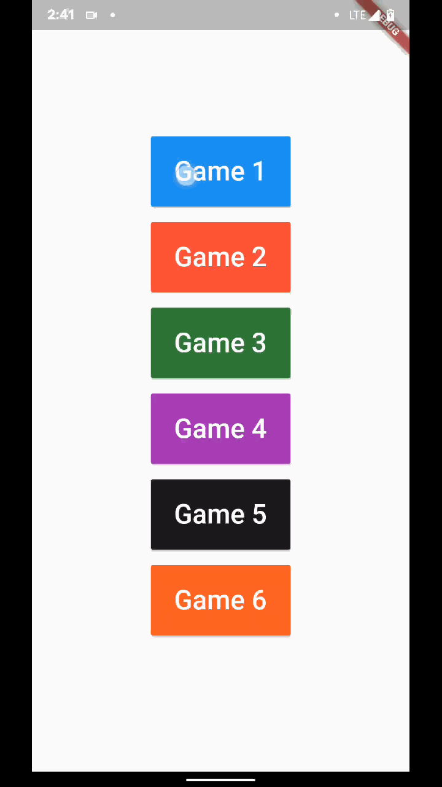

# Flunity

Flunity is a Flutter app that can launch multiple Unity Games (Game scenes). The games are packaged inside the Flutter app. 

Flunity uses a custom script in the Unity project that changes the scene based on user's selection in the Flutter side of the app.

## Links
[Download](https://github.com/itsarjunsinh/flunity/releases) | [Watch Demo](https://www.youtube.com/watch?v=Z4-SWY1wM6s)

## Credits

[Flutter Unity Widget](https://github.com/snowballdigital/flutter-unity-view-widget) for embedding Unity view.

## License

This project is licensed under the [MIT License](LICENSE). 
